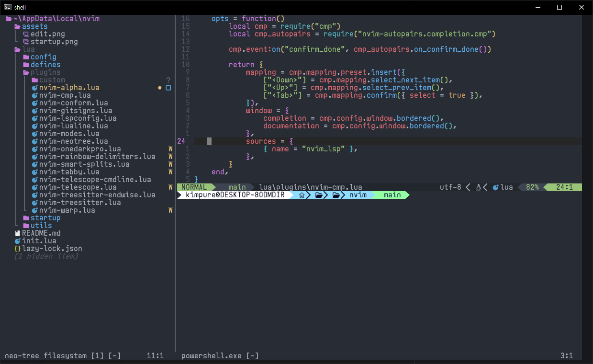
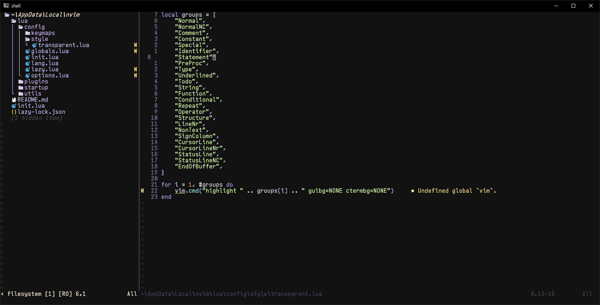
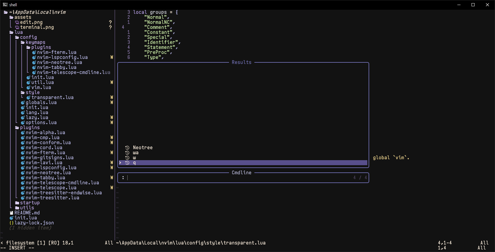
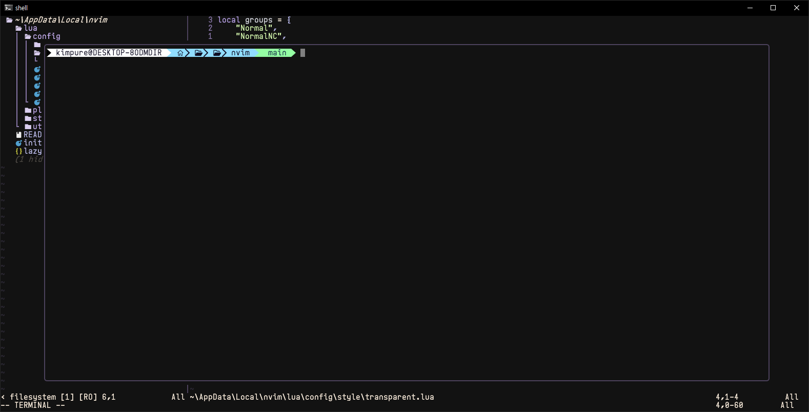

## [nvim](https://github.com/neovim/neovim) dotfile

## [plugins](./lua/plugins)
[lazy.nvim](https://github.com/folke/lazy.nvim)

[alpha-nvim](https://github.com/goolord/alpha-nvim)

[nvim-cmp](https://github.com/hrsh7th/nvim-cmp)
[cmp-nvim-lsp](https://github.com/hrsh7th/cmp-nvim-lsp)
[LuaSnip](https://github.com/L3MON4D3/LuaSnip)

[conform.nvim](https://github.com/stevearc/conform.nvim)
[cord.nvim](https://github.com/vyfor/cord.nvim)
[FTerm.nvim](https://github.com/numToStr/FTerm.nvim)
[gitsigns.nvim](https://github.com/lewis6991/gitsigns.nvim)

[lush.nvim](https://github.com/rktjmp/lush.nvim)
[lavi.nvim](https://github.com/b0o/lavi.nvim)

[mason.nvim](https://github.com/mason-org/mason.nvim)
[mason-lspconfig.nvim](https://github.com/mason-org/mason-lspconfig.nvim)
[nvim-lspconfig](https://github.com/neovim/nvim-lspconfig)

[neo-tree.nvim](https://github.com/nvim-neo-tree/neo-tree.nvim)
[plenary.nvim](https://github.com/nvim-lua/plenary.nvim)
[nvim-web-devicons](https://github.com/nvim-tree/nvim-web-devicons)
[nui.nvim](https://github.com/MunifTanjim/nui.nvim)

[tabby.nvim](https://github.com/nanozuki/tabby.nvim)
[telescope-cmdline.nvim](https://github.com/jonarrien/telescope-cmdline.nvim)
[telescope.nvim](https://github.com/nvim-telescope/telescope.nvim)
[nvim-treesitter-endwise](https://github.com/RRethy/nvim-treesitter-endwise)
[nvim-treesitter](https://github.com/nvim-treesitter/nvim-treesitter)

